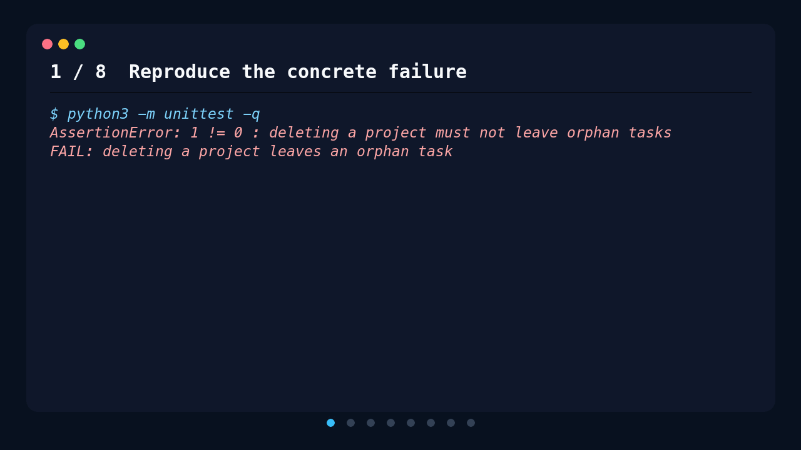

# Engineering Memlog

## Give your coding agent the debugging lessons worth keeping

Engineering Memlog gives AI coding agents a durable memory of hard-won
debugging lessons across projects. When a real failure appears, the agent
searches previously verified causes, checks whether one fits the current
evidence, and continues normal diagnosis when nothing does.

Memlog is not an error log. It records only non-obvious, reusable lessons after
the root cause and fix have been verified.

[](LICENSE)

[](docs/agent-support.md)
[](docs/agent-support.md)
[](evals/codex-skill.md)


## You probably need Memlog if

- **You keep saying, “We solved this before.”** The failure is familiar, but the
  useful explanation is somewhere in an old conversation, issue, or repository
  that nobody wants to search from scratch.
- **A one-line fix took hours to discover.** Source control kept the change, but
  not the misleading symptoms, eliminated assumptions, root cause, or prevention
  rule that made the investigation expensive.
- **Every new agent session starts from zero.** The previous session found the
  real cause, but the next agent sees only the current code and repeats the same
  investigation.
- **The same class of failure appears across projects.** A lesson learned in one
  service, application, or repository would have shortened work in another, but
  project-scoped notes never put them together.
- **General documentation gives the right theory but misses your reality.** The
  answer depends on the versions, environment, infrastructure, or conventions
  your projects actually use.
- **You move between coding agents and their memories do not move with you.** A
  useful lesson captured in one tool is unavailable when another tool encounters
  the same evidence.

If these situations are rare and most failures are obvious from the error and
nearby code, you probably do not need Memlog. It is deliberately for expensive,
non-obvious lessons worth carrying into a future investigation—not typos,
transient failures, speculative diagnoses, or a record of every fix. The
[sanitized examples](examples/entries.jsonl) show what qualifies in practice.

## A concrete example

An agent previously traced a misleading JSON parsing error to an upstream HTTP
failure and preserved the useful rule: check the response status before parsing
its body. Later, another integration presents the same pattern. Instead of
starting from zero, the next agent retrieves that lesson, checks whether the
current code makes the same mistake, and confirms the real HTTP 404 before
changing anything.

The value is not an automatic answer. It is beginning the investigation with a
relevant, previously verified hypothesis instead of rediscovering it from
scratch.



This is a deterministic walkthrough built from the checked-in
[fixture](demo/fixture), [with-Memlog transcript](demo/transcript.txt), and
[no-Memlog baseline](demo/baseline-transcript.txt). It demonstrates the workflow;
it is not a model-performance benchmark.

## How it works

```text
reproduce → recall → test the match → diagnose and fix → verify → preserve if reusable
```

1. **Reproduce.** The agent captures a concrete failure before proposing a fix.
2. **Recall.** Memlog searches for prior lessons that may explain the evidence.
3. **Verify or reject.** Every match is an untrusted hypothesis until its cause,
   environment, versions, and assumptions fit the current problem.
4. **Solve and preserve selectively.** The agent fixes and tests the demonstrated
   cause, then records the lesson only when it is non-obvious and reusable.

A miss or unavailable backend is a normal outcome. The agent continues gathering
local evidence and uses primary documentation or the web when the remaining
uncertainty is external. Memory can accelerate debugging; it never replaces it.

## Install

After installation, keep working normally. When the agent encounters a concrete
debugging failure, the skill defines when to search, how to evaluate a match,
what to do after a miss, and whether the final lesson deserves to be saved.

### Claude Code

Run these commands inside Claude Code:

```text
/plugin marketplace add atazifor/engineering-memlog
/plugin install engineering-memlog@engineering-memlog
/reload-plugins
```

That installs the skill, hooks, `/recall` command, and bundled `memlog` CLI
without a separate clone or `make install`. Claude Code adds the plugin's `bin/`
directory to its Bash-tool `PATH`. Start a new session after installation so the
SessionStart hook can run.

### Codex

Clone the repository, register it as a local marketplace, and install the plugin:

```bash
git clone https://github.com/atazifor/engineering-memlog
cd engineering-memlog
codex plugin marketplace add "$PWD"
codex plugin add engineering-memlog@engineering-memlog
```

Start a new task after installation. The skill performs the verified recall path
after it captures a concrete failure; automatic Codex hooks are not part of the
supported path.

### Other Agent Skills hosts

For hosts that support Agent Skills, copy `skills/debug-with-memlog/` through the
host's skill-installation mechanism and make `memlog` available on `PATH`.
These manual integrations have not been live-tested as separate Memlog packages;
see the [agent integration matrix](docs/agent-support.md) for current status.

For a host without Agent Skills, copy the short [mandate](MANDATE.md) into its
rules file. This preserves the search timing, no-hit behavior, and selective
write discipline, but it does not provide automatic activation.

### Standalone CLI

Use this when you want direct shell access without an agent package:

```bash
git clone https://github.com/atazifor/engineering-memlog
cd engineering-memlog
make install
memlog --help
```

`make install` symlinks the CLI into `~/.local/bin`; `make doctor` checks the
installation and `make uninstall` removes the symlink. Override the destination
with `make install BINDIR=/usr/local/bin`. Packaged Claude Code and Codex users do
not need `make install`.

## What Memlog remembers

Each entry preserves the part of a debugging session that source control usually
does not:

- **Problem:** the symptom that sent the investigation in the wrong direction.
- **Cause:** why the failure was possible.
- **Fix:** what resolved the demonstrated cause.
- **Prevention:** the rule that should stop it recurring.
- **Context:** the artifact, project, service, environment, tags, confidence,
  and source needed to judge whether the lesson applies again.

Git keeps the diff. Memlog keeps the reasoning that makes the diff useful later.
The complete entry contract is documented in the [schema](SCHEMA.md).

## Search and storage

By default, Memlog stores entries in one append-only local file at
`~/.engineering-memlog/entries.jsonl`. Its current search is deterministic,
field-aware ranked keyword search. It favors matches in titles, symptoms,
causes, prevention rules, and tags, with smaller confidence and recency
tie-breakers. Version 0.2.0 does not perform embedding or semantic search.

The entry schema—not the file—is the contract. Set
`ENGINEERING_MEMLOG_PROVIDER_COMMAND` to use a SQLite adapter, hosted store, or
cache without changing the skill or CLI. Provider failures are reported
distinctly and never silently fall back to the local file. See the
[provider protocol](PROVIDERS.md) and [retrieval roadmap](docs/retrieval-roadmap.md).

## Agent support

| Host | Supported path |
| --- | --- |
| Claude Code | Packaged plugin with the debugging skill, recall hooks, `/recall`, and bundled CLI. |
| Codex | Packaged debugging skill with live-tested skill-driven recall. Automatic hooks are not part of the supported path. |
| Other Agent Skills hosts | Manual installation of the canonical skill and CLI; separate Memlog packages have not been live tested. |

Support is reported by capability rather than by a blanket compatibility claim.
See the [dated integration matrix](docs/agent-support.md),
[Codex skill evaluation](evals/codex-skill.md), and
[Codex hook evaluation](evals/codex-hooks.md) for the exact evidence and
limitations. Host packages reuse the same
[canonical debugging skill](skills/debug-with-memlog/SKILL.md).

## Manual CLI

The agent workflow normally handles search and write decisions. The CLI remains
available for explicit searches, inspection, validation, and automation:

```bash
memlog search "build works locally but fails in CI"
memlog list --reverse
memlog validate
memlog --help
```

To append explicitly, pass a complete schema-valid lesson to
`memlog add --json`. Use `--file` or `ENGINEERING_MEMLOG_FILE` to select another
JSONL file.

## Security and data flow

With the built-in backend, storage and ranking stay local and only the selected
JSONL file is written. New files use mode `0600`; existing permissions are
preserved. Prompt text, project hints, and bounded failing command output may be
used as local search queries. Recalled entries and hook guidance enter the
active agent conversation context and are therefore processed wherever that
configured agent environment runs. A custom provider controls its own storage
and network access and is user-selected executable code.

Never log secrets, tokens, credentials, private keys, cookies, or connection
strings. The schema validates structure, not secret content. See the full
[security policy](SECURITY.md).

## Explore the project

- **Try it:** [reproducible demo and baseline](demo) and
  [twelve sanitized lessons](examples/entries.jsonl).
- **Understand it:** [entry schema](SCHEMA.md),
  [provider protocol](PROVIDERS.md), and
  [comparison with adjacent memory tools](docs/comparison.md).
- **Verify it:** [agent integration status](docs/agent-support.md),
  [Codex installed-skill evaluation](evals/codex-skill.md), and
  [discoverability audit](docs/discoverability-audit.md).
- **Contribute:** [retrieval roadmap](docs/retrieval-roadmap.md),
  [contributing guide](CONTRIBUTING.md), [changelog](CHANGELOG.md), and
  [v0.2.0 notes](releases/v0.2.0.md).

Engineering Memlog is deliberately narrow: one structured lesson format, one
debugging workflow, a zero-configuration local backend, and an escape hatch for
the datastore you prefer.

## License

[MIT](LICENSE)
